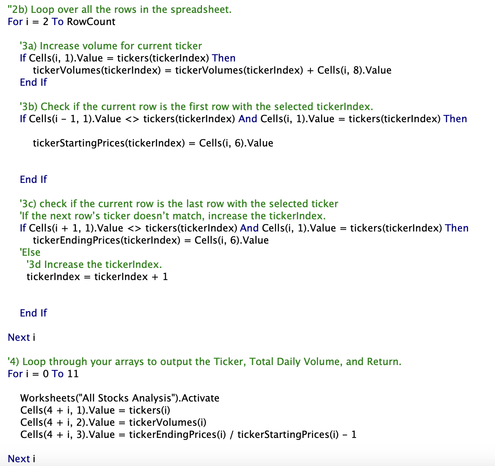
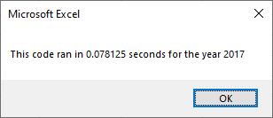
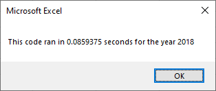

# Stocks Analysis

## Overview of Project
With the Stocks Analysis project, the goal was to use Excel to analyze datasets of multiple different stocks, with different data sets, all at the click of a button. 
## Results 
### Attempt Number One (green_sheets)
With the first attempt of coding this project it was simply completing the task that the code would work. Efficacy was not the main goal for this attempt. The code did work, it did exactly what it was designed to do.  With this attempt the code was constantly referring back and forth to get the information it would need to format the information out into the excel sheet. It is like going to the grocery store 12 times to get a dozen eggs. It works, but not very efficient.

### Attempt Number Two (VBA_Challenge)
With the second attempt we are trying to make the code more efficient so it will be less taxing on the machine. The code this time has been written so that it only needs to run once to each set of data, get all the necessary information, bring it back, then unpack it so it can be formatted into the "All Stocks Analysis" page. 

## Summary
### Advantages and Disadvantages of Refactoring Code in General.
Refactoring code has its advantages by making the code less work intensive for a machine to run. While a small example like this may not truly show it, when projects get larger, if code is not written optimally, it can have significant slowdown and make the user experience unpleasant. A disadvantage to refactoring code is it can be challenging. The developer needs to be creative to find ways to make code that they have already taken the time to make work, more efficient. This can also sometimes cause the code to break during the rewriting process. Which is why it is always important to save your work and have backups of when it worked last.

### Advantages and Disadvantages of Refactoring and Original VBA code.
In this specific example an advantage of having the code refactored is that it now runs the analysis at faster times.  
A disadvantage to refactoring the code is that it was a rather large headache to have done. While possible to do, rewriting code you have already made to work can be frustrating. It also can be confusing to read for someone who is just first looking at the code. That reason is why adding meaningful comments to your code is important.

